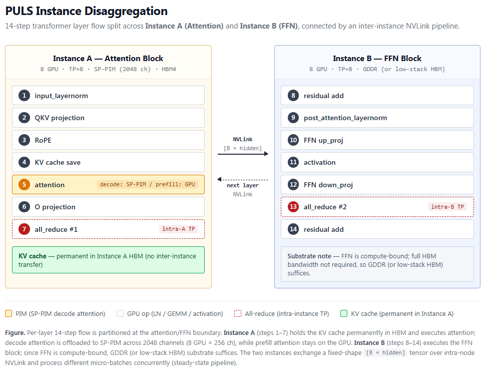

# PULS — PIM-Unified LLM Serving

**Scheduler-aware co-design of HBM-PIM and production LLM serving stack.**

> **Disclosure** — Personal research project by a single undergraduate author. No institutional / vendor affiliation.
>
> Self-study work in progress. Feedback, critique, and mentorship are warmly welcomed (GitHub Issues / Discussions).

This repo is the public RFC (Request for Comments) of an in-progress prototype. It provides the entry point of the architecture + design rationale + scheduler policy, together with a calibrated projection of the four acceleration sources on real long-context traces (see [Results](#results)).

Full body — [`ARCHITECTURE.md`](ARCHITECTURE.md) (substrate, instance disaggregation, scheduler integration, adaptive admission, layer flow, prior art comparison, all integrated).

## Table of Contents

**Background**
- [Characteristics of Processing-in-Memory Architecture](#characteristics-of-processing-in-memory-architecture)
- [Problem Statement](#problem-statement)

**The Proposal**
- [The PULS Proposal](#the-puls-proposal)
- [Approach Summary](#approach-summary)
- [Target Workload](#target-workload)
- [Acceleration Sources Summary](#acceleration-sources-summary)
- [Role of Mixed Batching](#role-of-mixed-batching)

**Results**
- [Results](#results)
- [Limitations / Disclosure](#limitations--disclosure)
- [Forward-looking: HBF-class Disaggregated Substrate](#forward-looking-hbf-class-disaggregated-substrate)

**Resources**
- [Interactive Reading Guide](#interactive-reading-guide)

## Characteristics of Processing-in-Memory Architecture

*This Section summarizes the structural constraints shared by every PIM architecture.* From HBM4E onward, custom logic-die fabrication begins. To execute MAC operations in parallel with ongoing GPU processing, PIM must place MAC units on either **the logic die (PHY) or the DRAM die of HBM**. This substrate choice imposes the following structural constraints:

- **Logic die (PHY) placement — area constraint** — Logic die area is limited; a meaningful quantity of compute units (general-purpose GEMV / GEMM scale) cannot be installed.
- **DRAM die placement — memory capacity reduction** — Adding MAC units to the DRAM die encroaches on memory cell area, reducing available KV cache capacity.
- **Thermal envelope constraint** — DRAM is heat-sensitive and cannot sustain large MAC workloads. Throttling necessarily accompanies PIM activation.
- **General-purpose computation unrealistic** — The combination of the three constraints above makes it unrealistic to absorb all general-purpose computation into PIM. Careful scoping of the PIM workload is mandatory.
- **Shared memory path — GPU ↔ PIM cannot occupy simultaneously** — Memory data cannot be simultaneously occupied by the GPU and the PIM core. Both sides must traverse the same shared path (TSV or inter-bank path), which becomes a potential source of latency in GPU-side data loads.

## Problem Statement

Limitations of existing HBM-PIM research, grouped by axis:

**Substrate-level (cell · bank · die)**
- **Memory-die intrusion** — PIM logic encroaches on the memory die, reducing available KV cache capacity.
- **Heat / thermal envelope constraint** — Thermal throttling during PIM activation halts PIM operation.
- **Non-standard DRAM circuit modifications required** — Dual row buffers, bank-level compute logic, and similar cell- / bank-level circuit changes deviate from standard DRAM fabrication, raising fab risk and yield concerns beyond ordinary logic ASIC integration.

**System-level (interconnect · resources · auxiliary HW)**
- **Complex auxiliary scheduling logic + extra hardware modules** — Bespoke controllers, DMA engines, and similar non-substrate components are required.
- **Logic die ↔ DRAM die / HBM ↔ host round-trip traffic** — Intermediate attention results (softmax accumulator, row max, etc.) shuttle between the logic die and DRAM die, and between HBM and the host (GPU / NPU), occupying the internal bus and the host ↔ HBM path.
- **Structural requirement of dedicated large-scale HBM resource beyond the GPU (in some designs)** — Designs that physically separate PIM-enabled HBM from the GPU's HBM impose an additional, dedicated HBM provision on top of the host GPU memory.

**GPU ↔ PIM concurrency (stall · path contention)**
- **GPU stall during PIM execution (in some designs)** — Some designs explicitly block the GPU while the PIM completes its work, serializing what should be parallel resources. The GPU's idle time during this window cannot be repurposed.
- **Shared memory path contention** — PIM and GPU share the same physical path (TSV / C/A bus / inter-bank path / row buffer). PIM activation contends with the GPU's concurrent HBM reads (weight streaming, KV transactions), slowing the GPU side.

**Serving lifecycle (KV cache continuity · session state)**
- **Multi-turn / continuation prefill not supported (in many existing designs)** — Existing designs commonly assume a single Sum → repeated Gen flow per request; continuation prefill that must attend to existing KV (multi-turn chat, chunked prefill, RAG with growing context) is not architecturally accommodated.
- **Bulk KV cache transfer between GPU and dedicated PIM resource (in some designs)** — When PIM-side HBM is physically separated from the GPU, the KV cache must traverse the host ↔ PIM interconnect (PCIe / NVLink / CXL), making the interconnect a bottleneck that partly nullifies the internal-bandwidth advantage of PIM.

**Workload coverage (model variants · batch regime)**
- **Incompatibility with modern serving features** — Lacks support for standard production-serving features such as GQA and speculative decoding.
- **Unstable performance advantage across batch sizes (in many existing designs)** — Across a batch-size sweep, the PIM-advantageous regime is narrow and the transition is discontinuous.
- **Inherent throughput limit of PIM attention** — Even when attention is offloaded to PIM, op-level token throughput remains limited.

## The PULS Proposal

*Why attention specifically?* Attention is universal across transformer-based models and admits online streaming compute — a natural fit for the PIM substrate.

- **HBM-PIM architecture** — substrate design that avoids the above limitations:
  - **Memory-die non-intrusion (P1)** — avoids encroachment on KV cache capacity
  - **Row-wise pipelined FSM (deterministic cycles)** — secures thermal-envelope predictability; PIM completion time is precomputed at dispatch
  - **Per-channel PIM / GPU toggle** — no separate DMA engine / bespoke controller required
  - **SP-PIM cross-GPU 2048-channel cooperation** — distributes the single-op-level throughput limit (8 GPU lock-step cooperation)
  - **GQA / speculative-attention compatibility** — modern serving features supported
  - **Row-wise accumulation inside the logic-die SFU** — avoids logic die ↔ DRAM die round-trip traffic
  - **Compute-bound timing alignment (P5)** — avoids TSV contention; PIM activation is confined to windows when the GPU is executing compute-bound ops
- **In-house scheduler** — compatible with chunked-prefill + mixed-batch primitives ([`ARCHITECTURE.md`](ARCHITECTURE.md) Section 6):
  - **Event-driven dispatch + dependency DAG** — encodes invariants (data dependency + resource) as a graph, reducing dispatch to a ready-node selection problem
  - **2-μ-batch lookahead** — starting work for the next μ-batch early + filling idle resources with work from another μ-batch (emerges naturally)
  - **Adaptive admission with hysteresis deadband** — dynamic admission based on measured GPU / PIM idle fractions, stabilizing the PIM advantage across batch sizes

## Approach Summary

- **Instance disaggregation** — The transformer layer is split into Instance A (attention block, 8 GPU, TP=8 + SP-PIM 2048 channels) and Instance B (post-attention block / FFN, 8 GPU, TP=8). The two instances are connected serially via an inter-instance pipeline. The KV cache resides permanently in Instance A's HBM (no inter-instance KV transfer). Additional effects that this split yields:
  - **Instance B substrate-cost reduction potential** — Instance B is FFN compute-bound, so HBM's full bandwidth does not contribute to B_cycle. Substituting **GDDR (or low-stack HBM)** can reduce unit cost ([`ARCHITECTURE.md`](ARCHITECTURE.md) Section 3.4 "Instance B Memory Substrate").
  - **Fixed-shape tensor handoff → straggler-bubble elimination** — KV-length variance produces variable-shape tensors in the decode batch, but PIM absorbs the length dependency at the attention stage, and only fixed-shape `[B × hidden]` tensors are passed to Instance B. Instance B performs uniform GEMMs without ragged batching, eliminating decode-batch straggler bubbles ([`ARCHITECTURE.md`](ARCHITECTURE.md) Section 5.2).
  - **KV-cache-movement bus-transaction reduction** — Since PIM processes attention in place, GPU ↔ HBM KV-streaming traffic is eliminated outright. In the long-context regime, where KV bytes read is the determining factor of attention time, the effect is large. **Incidental thermal reduction expected** (bus-transaction energy ≫ compute energy) ([`ARCHITECTURE.md`](ARCHITECTURE.md) Section 5.7 auxiliary item).
  - **FFN-weight bus-transaction reduction** — When PIM absorbs the attention length dependency and mixed batching is reinstated, prefill chunks and decode tokens share the same FFN weights. The token denominator of weight HBM traffic grows, reducing per-token FFN-weight bus transactions + raising arithmetic intensity. **Incidental thermal reduction expected** ([`ARCHITECTURE.md`](ARCHITECTURE.md) Section 5.7 auxiliary item).
- **HBM4 logic-die SP-PIM**:
  - **Compute substrate** — row-wise pipelined attention SFU, 32-row tile FSM @ 1.3 GHz, FP16 MAC + FP8 (E4M3) KV cache (aligned with the production FP8 KV regime)
  - **Channel-level PIM / GPU toggle** — Each of the 32 channels per HBM4 stack can be independently toggled between PIM and normal mode
  - **SP-PIM cross-GPU cooperation (Q-replicate parallelization)** — Instance A's 8 GPU × 256 channel = 2048 channels in total cooperatively process a single attention operation in lock-step. The same Q vector is broadcast to all 2048 channels and KV rows are sharded across channels, so each channel independently sweeps its own KV slice → a single attention operation executes in parallel across 2048 channels
  - **Row-wise accumulation inside the logic-die SFU** — Intermediate attention results (softmax accumulator, row max) accumulate inside the SFU, avoiding logic die ↔ DRAM die round-trip traffic
- **Interceptor host↔PIM interface** — A direct consequence of confining PIM to the single decode-attention operation. By **claiming a single RFU (Reserved For Future use) bit of the existing JEDEC HBM4 RD/WR commands as PIM_toggle**, the host↔PIM interface is absorbed into the standard DRAM command set. No separate interrupt required. Based on the FSM's deterministic cycles, **computed wait** lets the GPU precompute when the result is to be read. The only channel between PIM and GPU is HBM (PIM write → GPU read, the same pattern as inter-kernel data passing through global memory on the GPU) ([`ARCHITECTURE.md`](ARCHITECTURE.md) Section 3.5).

Full body — [`ARCHITECTURE.md`](ARCHITECTURE.md).

## Target Workload

The primary target of this RFC is the **long-context + large-batch production serving** regime — multi-turn agentic conversation, 1M-class long-context inference, high-throughput chunked-prefill + mixed-batching scenarios. In this regime, PIM's KV-cache absorption + systems-level F3·F5 effects (inter-instance pipeline, channel-independent scheduling) manifest meaningfully vs. baseline.

- **Favorable regime** — long context (≥ 32k), high batch (B ≥ 128), production traces with large KV-length variance (agentic workflows, multi-turn chat, etc.).

## Acceleration Sources Summary

| ID | Source | Scope |
|---|---|---|
| F1 | SP-PIM attention (2048-channel Q-replicate, 8 GPU lock-step) | Op-level |
| F2 | Projection ‖ PIM attention double-buffering (intra-instance) | Op-level |
| F3 | Instance A–B inter-instance pipeline (steady-state) | Systems-level |
| F4 | μ-batch staggering (steady-state precondition for F2·F3) | Systems-level |
| F5 | Channel-independent PIM scheduling (absorbs KV-length variance) | Systems-level |
| (Aux) | Mixed batching resurrection (shared weights → arithmetic intensity ↑) | TTFT / throughput trade-off |
| (Aux) | Bus traffic reduction (PIM in-place attention → HBM-GPU bus transactions ↓) | Energy / cost |

## Role of Mixed Batching

- **Primary purpose: securing the PIM TSV-occupancy window (compute-bound headroom)** — Under pure decode alone, projection switches to memory-bound, and the PIM headroom may be insufficient. Admit additional prefill-chunk tokens into the mixed batch to push the effective N into the GEMM-saturating regime, keeping projection in a compute-bound regime.
- **Side effects (derived from weight sharing)**:
  - prefill chunks and decode tokens share the same weights → arithmetic intensity rises
  - per-token FFN-weight bus transactions decrease
  - inter-instance KV transfer is eliminated (coexistence within a single instance)

## Results

Calibrated projection of the four acceleration sources (Aux1·Aux2·F3·F5) on Llama-3 70B + DGX B200 + HBM4 substrate, plus a runtime validation pass on a long-context production trace.

> **Visualized companion** — Per-source schematic figures + numerical breakdown + runtime validation + honest disclosure are organized in the interactive reading guide as **§6 Acceleration Sources** and **§7 Results**: [`docs/scheduler_policy.html`](docs/scheduler_policy.html) ([online](https://rhydcdc.github.io/puls-rfc/scheduler_policy.html#sec-7)).

### Substrate

| Component | Value |
|---|---|
| GPU compute | DGX B200 standalone, FP16 dense 2,200 TFLOPS per GPU |
| Memory | HBM4 hypothetical projection, 16 TB/s per GPU × 8 GPU = 128 TB/s aggregate |
| η_HBM_external | 0.74 (fix) + sensitivity sweep {0.70, 0.74, 0.80} |
| PIM tile time | 267 ns (compute-bound, FP8 KV) |
| RTL FSM | 347 cycles @ 1.3 GHz |
| MFU | 0.6 default + sensitivity sweep {0.5, 0.6, 0.7} |
| Model | Llama-3 70B (L=80, hidden=8192, FFN intermediate=28672) |

### Per-source Acceleration

| Source | Mechanism | Result |
|---|---|---|
| Aux1 | Mixed batching weight reuse | **2.0×** (closed-form), 1.97× (Colab T4 measured) |
| Aux2 | KV bus traffic reduction | **4.95× speedup, 79.8% reduction** |
| F3 | Inter-instance pipeline ratio | 0.92–0.99 (closed-form ctx sweep), **0.5933 (measured = near-balance)** |
| F5 | Channel-independent vs lock-step | **5.15× speedup** (KV variance dominant) |

### Aggregate Speedup

| Component | Baseline | PULS | Saving |
|---|---|---|---|
| Weight streaming | 2.89 ms | 1.45 ms | 1.45 ms |
| KV bus traffic | 8.25 ms | 1.67 ms | 6.59 ms |
| **Total (weight + bus)** | **11.14 ms** | **3.12 ms** | **8.04 ms (72.2%)** |

Net speedup: **3.57× (closed-form, weight + bus)** → **4–5× (including F5)**.

### Runtime Validation

LongBench λ=3.40 first 3 requests (sum prompt 408,148 tokens; 47K + 280K + 81K), end-to-end scheduler simulation, single task. Wall-clock 5.4 min, 15.26 M admission ticks, 50.87 s simulated clock.

| Slot | Active (sec) | Idle |
|---|---|---|
| GPU Instance A | 50.82 | 0.10% |
| PIM Instance A | 0.17 | 99.66% |
| GPU Instance B | 34.95 | 31.30% |

| Convergence | Value |
|---|---|
| converged | True |
| oscillating | False |
| in_band_fraction | 98.70% |
| samples | 15,261,787 |

| F3 cross-validate | Value |
|---|---|
| closed_form_ratio | 0.9964 |
| measured_ratio | **0.5933** |
| abs_diff | 0.4031 |

Interpretation:

- **Both instances actively contribute.** GPU Instance A and Instance B record 50.82 s and 34.95 s of active duration, respectively.
- **Instance B's 31.30% idle is the intended A-bound branch behavior**, not a balance failure. In a long-context prefill-dominant trace, Instance A's prefill GEMM saturates the cycle; forcing additional admission to fill B-cycle would shift work onto an already saturated A without throughput gain.
- **F3 measured 0.5933 ≈ near-balance** (perfect = 0.50) quantitatively proves the balance mechanism is active. The gap from the closed-form 0.9964 reflects the difference between an idealized single-μ-batch projection (single ctx, single chunk) and the real multi-μ-batch steady-state pipeline (thousands of cycles, concurrent A→B dispatch, FFN op_time per μ-batch).
- **All four balance branches reached steady state.** The deadband held over 15M+ admission ticks without oscillation; in-band fraction 98.70%.

### Honest Disclosure

- **HBM4 substrate** = hypothetical projection (current production absent; ARCH §3.1 literal alignment).
- **η_HBM_external** = H100 HBM3 measurement extended to HBM4 (Framing A).
- **F1·F2 ablation + comparative baseline (vLLM / Sarathi-Serve)** = deferred to subsequent calibration (calibration-heavy).
- **Absolute metrics** (TTFT, TPOT, throughput) = silicon absent, permanently out of scope.

## Limitations / Disclosure

- **No hardware in hand** — No actual H100 / HBM4 silicon. Relative source decomposition is calibrated (see [Results](#results)); absolute metrics (TTFT, TPOT, throughput) remain out of scope.
- **HBM4 estimation** — Based on the JEDEC JESD270-4A spec + in-house Ramulator2-based cycle-accurate measurements (FP8 tile load / FP16 tile load / PIM compute regimes) as references.
- **RTL substrate** — Limited to an open-source flow (Yosys + ASAP7 + OpenSTA pre-CTS). Out of scope of commercial signoff.
- **Single-vendor production trace** — Publicly available long-context agentic production traces are effectively limited to one. Disclosed as a limitation; augmented with a 1M-class benchmark dataset + a mid-context production chat trace as supplementary axes.
- **Main claim quantitatives = projection** — Pre-silicon numbers are *estimates* with provenance labels (see [Results](#results)).

## Forward-looking: HBF-class Disaggregated Substrate

Beyond the HBM4 SP-PIM main claim of this RFC, mounting PIM cores on a **separate memory tier such as HBF (High Bandwidth Flash)** is a direction worth further examination. Structural effects:

- **PIM duty-cycle ceiling lift** — PIM can run independently of the GPU's HBM occupancy phase, so the *compute-bound timing alignment* constraint (P5, the requirement that PIM activate only inside compute-bound windows to avoid TSV contention) is dissolved at the substrate-topology level.
- **Memory path sharing resolved** — The GPU ↔ PIM contention on the shared TSV / inter-bank path is structurally avoided through substrate-level separation: GPU keeps its HBM bus, PIM operates on the HBF bus.

That said, **HBF specifications remain unreleased at this time**, so data load latency, hot/cold KV cache tier partitioning policy, and write endurance constraints cannot be quantitatively specified. This item is *directional only*; the quantitative follow-up belongs to the period after spec disclosure.

## Interactive Reading Guide

The core scheduler policy of PULS ([`ARCHITECTURE.md`](ARCHITECTURE.md) §6) is also available as an interactive single-page companion. The guide is organized into five navigable sections — instance disaggregation, invariants & dispatch DAG, scheduler usage (pseudo-code), adaptive admission, and a worked dispatch trace example — designed to be read sequentially or jumped into by topic.

- **Online (rendered HTML, hosted via GitHub Pages):** [rhydcdc.github.io/puls-rfc/scheduler_policy.html](https://rhydcdc.github.io/puls-rfc/scheduler_policy.html)
- **Local:** clone the repo and open [`docs/scheduler_policy.html`](docs/scheduler_policy.html) in a browser

## Repository

- [`README.md`](README.md) — this document (entry point)
- [`ARCHITECTURE.md`](ARCHITECTURE.md) — architecture body (motivation, design principles, substrate, instance disaggregation, scheduler integration, adaptive admission, layer flow, prior-art comparison)
- [`docs/scheduler_policy.html`](docs/scheduler_policy.html) — interactive reading guide (companion to ARCHITECTURE.md §6)
- [`LICENSE`](LICENSE) — Apache 2.0

## License

Apache License 2.0. Details — [`LICENSE`](LICENSE).
